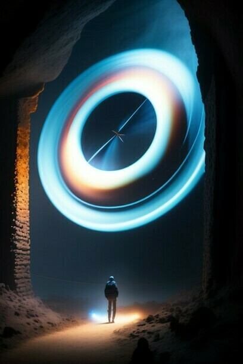
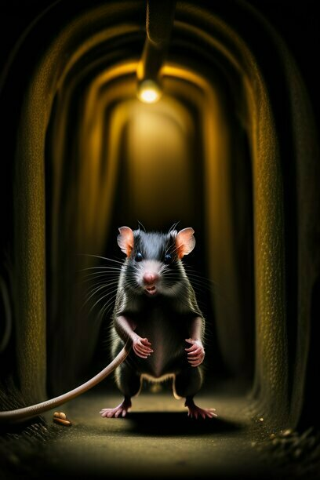
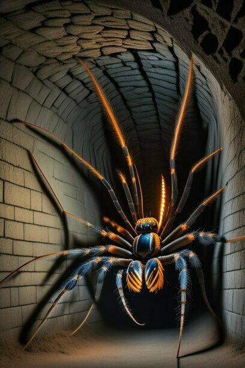
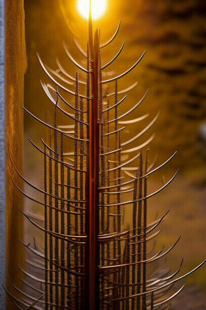
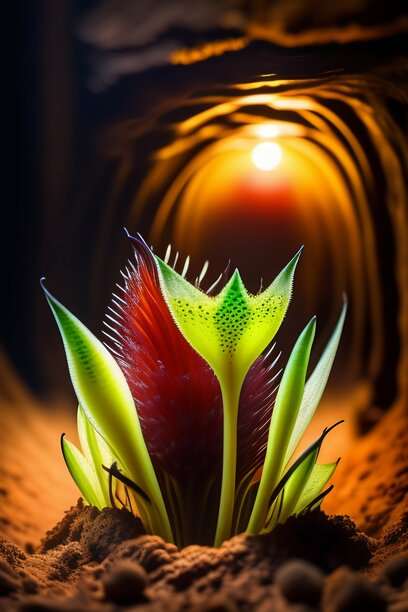
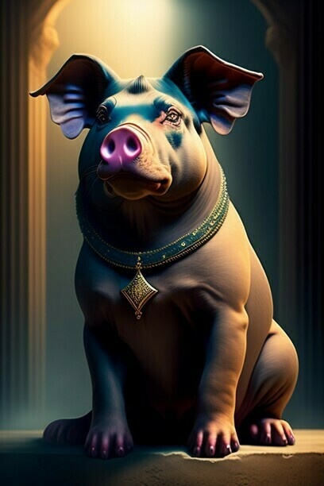
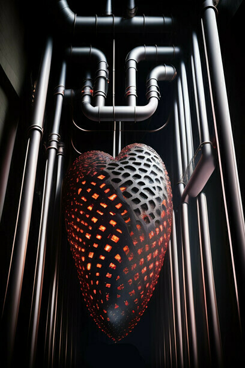

# 7.7.7.7

Long-long ago, between the world of darkness and the world of living people,
it was built - a line of defense, a trap for dark forces. The Net.
But from the blows of the creatures of darkness, cracks are already scattering across it.
This battle cannot be won. Gotta get down to the lair of Darkness and strike evil 
straight into the heart.

## Bestiary

### Wortor

*"Seems like I've seen this somewhere before..."*

The Worthor is one of the most feared creatures of darkness. It does not take your life, but wandering again and again through the same nooks and crannies of the dungeon, you will gradually lose your mind and lose hope of getting out. It's best not to encounter this glowing vortex at all unless you want to spend time going through the same dungeon sections multiple times.

### Rat

*"Oh no! they are everywhere!"*

On leftovers dumped into the sewers, fueled by the malevolent energy of the Heart of Darkness, these monsters have grown to unimaginable sizes and are hungry for fresh food. They will definitely attack you to bite off a piece or, if you're lucky, gobble it up whole. I advise you to avoid them if you can.

### Spider

*"There should be a pun about spider webs and the Web*

The second name of these spiders is death. They will poison you, tear you apart with their mandibles, tangle you in a web. Still nothing if it is one old slow spider, but if there are several of them nearby or they are young and fast, be especially careful.

### Grass

*"Worse than paper cut."*

Even the grass in the dungeon can be dangerous. If it is awkward to stand on it, you will feel how tiny sharp knives stick into your legs. I wonder if it's red by itself or someone has already passed here before me? It's good that if you quickly run along it, you can not cut yourself.

### Plant

*"Good thing they don't smell!"*

What can grow in a dark dungeon without sunlight, among monsters, dangerously close to the center of Darkness? Certainly not daisies. You should not approach these plants, which are more likely to "tear" you themselves than allow you to come closer to them. Everyone needs something to eat, try not to become their dinner.

### Swinx

*"It's time to remember everything you were taught in school."*

But that probably won't help. Swinks' language is the language of Darkness, his favorite lesson is anatomy, his grades are: 5 for cunning, 5 for gloominess, 5 for philanthropy (mmm, delicious!). If you have to guess his riddles, remember this.

### Heart of Darkness

Game made with [8bitworkshop](https://8bitworkshop.com/)

Map made with [Tiled](https://github.com/mapeditor/tiled)

Music made with [Furnace](https://github.com/tildearrow/furnace)

Images for this README generated with [Lexica.art](https://lexica.art)

Playable link: [Play!](https://shadowlamer.github.io/7.7.7.7/)
