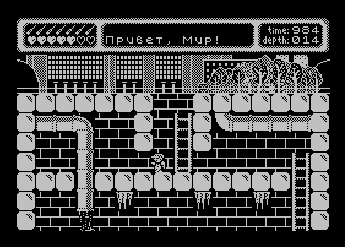

# 7.7.7.7

Long-long ago, between the world of darkness and the world of living people,
it was built - a line of defense, a trap for dark forces. The Net.
But from the blows of the creatures of darkness, cracks are already scattering across it.
This battle cannot be won. Gotta get down to the lair of Darkness and strike evil 
straight into the heart.

Game made with [8bitworkshop](https://8bitworkshop.com/)

Map made with [Tiled](https://github.com/mapeditor/tiled)

Music made with [Furnace](https://github.com/tildearrow/furnace)

Playable link: [Play!](https://8bitworkshop.com/v3.10.0/player.html?p=zx&r=TFpHAACijQAARYV4ic00AZBcjdnz7VbNcdTN1VwAxwDZH9kf2R%2FZH9kL881x1CEA%2FTb%2BXVQTAQAB7bA%2B%2Fe1H7V77zUuh%2FSEB%2Fv1%2BALfKD1%2FNLqTDM1%2F9IWX3%2FTYAh%2F02Afb9IWeNRP%2BNxGmNREeNBPfN4L3NDb4h%2BI7lzQ3I8SHnAyJ49yEl82591rDSrmD9IWH3%2FX4A5gf9IbDz%2FXcAjSoA7Uuw82lgKSkpCU1EISLz2aHtQ7LzXAUOCY2Oao3OtPPb%2FuYf7h%2F9Ia%2BNdSoi83y1t8qxX1wCWD54ldK5X%2F0hbVwCggHZ41wCs%2FFfXAUe8Y2efdZ40vGNHl2NVuYDwuZfw%2Blfw41KjbAAXAcwIWD9IV%2BNQ9ZR%2FX4B3gHSIWDN4Kj9IQtcIgr9IWz3%2FXcAwzVcBMjLAEbCL2DDMmCNCc2Mxiq08%2BUqsvPlzdOs8fEBIvMhsvN5lngjntJxYMXFjZHQtvHxwX23ymiNCc1nxPHBIQkACU1Ew0VgjRd%2BI2ZvXAKpjo1F5Y1X2eP%2Bw%2FFcA2U0AMKbYP00ASEeAeUqePflzTXF8fHNJ8LDR18havPlISKNJA228Y0lflwEwsxgzROkw%2FtezfCj2aHJXF4w2RAD8AfgXBoYAhAEIFwcGNkB%2F%2F%2FZwwjZYUBcEhiqq42djVhP%2F%2F5cEBjVVdmDjVhNVVZcB5hQBqBcBjg%2F%2FNmBjVhKqqpcBziwBWBcBjg1VFwSOApcBzgqrI14H%2F%2F4XAo4EAgQXAc4V%2F%2F1VQgaqqhcCTgEXAcYjTitVVqrCBVVWFwJOAQIXAk4Vqq1XA84XAcYXBw4XAY4SVwIOAaoDVBcCjj%2F%2F%2F9V2WFcBzgFWAqwXAo4gAABqtlhXBI4r%2F%2BNOI0UVY1cXBE4WqtcEThcCbitVVwROFwJuI24ttttqtlhV1wm2lwOOI0UVdlhq1wG2gQIEFwSOFZcJhpcCBhcC3hcBzgG%2BBv4XBo4BfgXXAUYXBR4XAU4%2F4BcGzgAqoBcDnhfXETnXAU41VwQOFxC5wAACAgQXEKKXAc4XAd4XVxC51wHGFwbOI24%2F9kDXAh4XVVcA3kKrBVYjbiAjUYBXAo4XANZDVQaqI24jdhcCnhcA1lcGzjZAQ90G7jZwa%2F%2FjdhcCniNeDAN3C7o2eHWjW3ZQVwOOFgPdDuNeK1cAm3ZQVwOeKwP%2FD%2F8XBg4B1Yf3C7sAADgrVVcDnhcIwf6qyCNeAdcAFwQOI2oFFXKPI0YOANcEHiNWOMqrkVXf7wAwFwReJjGMY0AXADVKpIah%2FwDAAAtXA94jVjVqlVY1SH0BAAAFlwSeB9rVQusiwj%2BCAAADVwQeAcAKq2GTU2tBLmwAAAGXBA4Co5VVyEOhUpwVlgAAANcEHjRcer9M62uBiBorAAAAlwQuOSggVOaBYamplVUjTFcEHjSVIStTyZURWxLoo0YXA84gakypXendUWKuSlZXESZXAx4gRVVlCrTRoeoOjWKjRRcDziZDYsMtKPNpw0wUqmNGNVcDniaJQ0FO%2BuKllHyYViNGGpcDjiCrUsWX5MNjhR8mIpAAABcD%2FiEYpSMvLMaR1J4iUzAjTiN2FyHuKqMKRpFfUM2Lu04qS2NODWDw9kBwVqDw8FV2WGrVZUx1UTqoypWJrkarI00KlwNOK%2Fq6TK1vptWj9HajM2NFDWB2QNa2WFV2WGrWBYmys73b7%2FWyr1JLY0yKo3YtdlhqtlhVqqp%2FVetXrdepz1aqt6NGFwOOFFKqqpWp06j5mq5XWwAXGTV2Rhc%2FMHZB1yCJ9kKAlwOCFwD4tkFBFwKBdkEIlwKBQFc6cPZBQlcC2WABFwOGFwLCVwOddkBXKXHXBSl2Q6AXAxHXARLkAkAiQFcEi1cCFpcArdcDtqAAEJcCBhcC4XZBURcCFhAkAUANNkGQI0rKFyjiY33BVwR2ACIVFwIBOgEXAuaEAAAAlBhKFwHCIKgjcRcCj8EEFyiiY3PIcJcDFMgAAAMAVBsXAd4BqAgXCunXAJBEFC0kAYBegFDYFyi0FwI3dAAgBFCqNRcBgsCi7BcK1gKjSUEEXVWXCbvQaVQgqAAAJRcB1aNBQKUtUUAABiNiANKqI14RFwGaB%2BAAQAgIXqSgKBIXAR3lBRFhAAgFFwGNxeNOACwvAFcBecBCcJKAkgAhFwH91sAAQACUvSE0NnBjQcFo6AEKoASXCfeBS%2BNbehwAFFQjRcRIAqFhCsFFFwDdFwk3b4ABAAKorUCOqgAgEAEACsDoAHtkABAEFxGjAr1AAACD9B0AU1UAAIAQgA%2BgZAAFHbAKAQgXEVKBdwAAogboHUAL%2FwQgAAQgNwLyAFbco10gY2YC9QABEI%2FQjgAjQBegEgAggD6AaAUP%2BhUjTWN%2BB1YAAAovqg6gCeqCAJAEEH0BdAAarQjKAAAko34qAQAgP9EPEAWq0ggAAQH8CDlUTvQF%2FSAAKGNmBqoBFID%2FaI6AF9VCAgAEgvoAeCA7dUV%2FkAAhI0WAVAKsAoAAv9UnIB10IgCgAkf8kTyIv%2FAC%2F8AAKKNdy9LWCSQAAX%2FQi4gvVQISSAML%2BgQ4IPL1AD%2FwACkjVhWqqgMAAP%2FKR0A9cgKAIgLH%2FJCckfX0KC%2FwFwkNxXVsAQkh%2F6FXpLatBgSAB0f2QApeIVv1ADr8ADKXALZCrbwDBAD91VXSV3dUABAFh%2FspLQG99WAftgDSFwipyLbUARKmXuqX4KWt7EAAC4LvXL9CL%2FqAVWqBaCRjRgJL7CEdK1tlQ%2FgD%2B7oAQA%2BF1bZAFwAgP%2FqIP7gA3QJFAAABL7wBFlcAPbW11AHu6AEUF4LuvV%2FBT%2F1A3ApCagJ6gAAIr9whHSmVdVP%2BAP80BEIfAKu9V3CX9yD%2BVAB8Eb%2FAAAKv2gu%2BqV79VfuA%2F7IBOh8E7f1f3D%2F%2BqXyQAHoA%2F%2BAACV%2B8qr1Qi%2F9b%2FsJemgCv3gA%2F%2Fa%2F2r%2F9UvWgC%2FAAf%2BAACv7pf%2FqUW%2Ftb9wH%2BKCr%2F%2FAF%2F61%2F1%2F%2F6p%2B2Ai4kAv6BBX%2Fuj%2F8Aot%2Fb%2F%2FhL60C3%2F8AP%2F1v77%2F%2F%2Fj%2F0AfwADvwQC3%2B7X%2FqVp%2Fu7%2F%2FFfTQlzo043t%2F9XKK2wR7pAB1%2BEbf96r%2FgJ8v7u%2F%2F1vloXh%2FwB%2F%2Fd%2FjRb9%2F%2BIX9KBf1Ul%2F%2Fer%2F4FevjQv6vjqPh34B%2F93f%2F7%2F%2F%2Fu%2FQvfIANXkU7f3L%2F%2Bh%2F%2B40Y%2F76vZ4f6AY1C7%2F%2F%2B%2F%2BJu%2FUD%2BlEL%2F%2F%2BV%2FwTd%2F9%2Fv%2F%2Bt47%2F6f%2FAX%2B3XANYd%2Fn76pF8UAB1%2FcL%2F8FONCr%2F%2Fvx%2F%2Fx%2FsF%2F9%2BNev613Vr%2BofqoCOv%2Fwf%2Fsc40K7%2F3eLf%2BH%2FYP%2Ff91%2F7%2F%2F9V%2F%2Fr%2F1S9cAD3%2F0r%2F9jP%2F%2B404fx3%2Fz%2F6X%2F1wCpP%2F%2BqY0QVH20Ia%2F9xf93c%2F%2F9%2B6%2F%2Fuk2NFE%2F%2FV%2F5%2FjRhQtSf%2F%2FL%2FwBdeNCva3%2F%2FX%2B3%2F%2FdHX%2Ff%2Fb%2F%2FTduNGP9UqpX%2Fv3%2Fsg1%2F9v%2Fbz%2F%2F%2F6fZ%2F%2F%2Bx3%2Fv%2F9v%2Faf3X40YIlQX2aHwT9%2F%2Br%2F%2B9b%2F%2F8tV%2F%2FrR1%2Fv%2F%2B%2F%2FpGrjXiwSY0ef%2FKWr%2F3X%2FvW%2F%2F%2FZov%2F%2Favf1%2F%2FX%2F%2BgteXjRiVJD%2F%2F%2F3v5X7%2F%2Bn%2F%2B%2B7%2F%2F%2BqF%2F%2Fb%2Fr1jRH6Uknv2cHQEL%2F%2F%2F7%2F8ur%2F%2Bv%2F3dP%2F%2F9ZX%2F%2F3vqqjRH%2BiWXZof%2FpSFwCXv7u2YKNKPWyjQFpVY1GosiNWOQCjVj3tVzqqfaNIf%2F%2F1I24%2BqmNi1wjZdkdXPz42QI%2F%2BH%2F8%2F17%2Frv%2FW%2F%2B7%2F9v%2F%2B2Sh%2F%2FD%2F4XKLn2ST%2F%2F1wHA9kj%2F%2F%2BNwT%2FUP6zZdCqof9Z%2F6g%2FwMAxH4kgSk8mkJamVqVWkVZOVSCVHyTASD%2BIADB%2FwjSSvP9U%2F6x%2F1H%2Fof%2Fw%2F7D%2F8H%2BwP%2FAfsA%2FwA%2FAANcxCT%2F%2BlVVqqrZYVwirfvZaI1YXMKH8AC%2BAFeAqsD1YP6w%2F1j%2FuP%2FY%2F6z%2F1KqsXAJ42SHWqo0GjQrYjRJY%2FrD1YKrAV4C%2BjS7ZBw8AfwH%2FA%2F8H%2Fw%2F%2FH9kjP%2F8%2F%2BzVVa%2F5%2F%2FmAOcAzZYm%2F%2BdVwAXAYEjch6rNnijXcBENkiEdkiqBG4EagruDt0M7QrdHO8f%2FZv%2Fj3OLtQtzC7cHdQViB2IFYgI2SKA2SKNdPAP4AeA2SPgD9khA8ABgNkkA%2FAH2SIAAAfgCrA%2FUATgD6AFwAOACDgavDOMJtgHwAbgBnADMFwLOAeAA9kiwAPw2SQP8A9cDTiQADg4GrgDiAbYB8gFgANABuBcFnjgAcAP2SJcFHgGxAfADuAcYBhgjXjgjSbgAVwCpsBcAnqNuMABXANIjbgNUAr8ByAF8AOgAcAcED1YMcwbZAPgB2AOYAzAXAo44AfAjTDZIQNcBHRcBrhcCDgJwBwcHVgRwBtgE%2BABoALAB1wXeIAHXAT8XBR4I2AD4AdwBjgGGPgPXCRg2SMD8FwEeAHAA%2BAP%2BNkh%2Fw8AAAPgBVACoI2X4AHIAAwZTB3YD404A2AAAABgXAo44AfAD1wFOAHgA414%2BH9cDDgJwBgAjTjcD3iN%2BAMAw%2F%2BBg1wm6o0HAZAGAKrgAOAB4B%2Fw%2FwAABgAJwAg8CAJwAoAEgARACCAQIAgiCCXEJDgYjSBcGziNuBgAJDglxCIIKMgvUEhImySElHJyC4IIPAnABo0g%2F8PBgVwmqlzixpAHAuwHgAf4B1wC%2BAAYHCw3tBrsFVQIjBQWOqswF2q%2BdVA%2BsAPwAGAAAPh%2F4Bhc5f7ZBcAA4AHiA%2FwB%2BFwjjgEAAgAOwhPkM%2FRe8onyUbITcgT8COAAsACYAQQDDA4w%2FH%2BNII0sXAo6gADiAf4D%2FgH8APyNBo06ZA7yE%2FEz%2BV76ifpRuidyCPwAjboARAHGXBV4B%2F7ZIfgB%2BFwFeB%2FkP1wOeJAAACAAwAOc%2Fh8YB1wjMNkIA4AHwEeAP4AfXGIOAIAAQENwJ8gvzE96T5FNik7IPyAHEA0AGQAggDDADHD%2BjSAAXA46AYBHwH%2BAfwA%2F2SEAAIAmQE9wj8ifzF96X5Fdik7kPxAHAI16IgBjgFwUeOBH4H%2Fgf4AfgB9cBXj4L%2FxcDHgJAASNLznA%2F%2F%2F4H9ki8AjwkAUEVVwoBAgfHFwCeAACQAJAA8AH4gWi48QX6Q2yP%2FxNsJfuI8BBjSNcBjgQkAQKJtkHXEIKiBGMMVwIOEfiRaIjxBfojQCxf%2F4NsBfoI8QhhFwPOFwKwAD4EPw4XAk44EWgI8eX6E2wP%2FwNsnfpA8QBggAAiBGIEVwCZFwKMFwCRFwETlzCuCGEXAJuDbB%2F%2Fo0AsVwCbkWiR%2BIDwFwCTFwKpsAD4AeNaNkOU8pP8i%2F0H%2FgP8APAXNL4jRvD%2F4P%2FA%2F4D%2BAfgD8AfgD%2FZIX%2BAf8D%2F4VzoOBgAOABwAOADwA2AGoA1ACkAGgBco%2FGN%2BI0iwP%2BNbI10wB%2FgD%2FgH%2FgP%2FA%2F%2BD%2F8Nc5ngMjSopADUAGoANgAPAAOAAcAA4kAQFAlwHoYP%2BXAf8%2FgGNNFzwuDgA1H%2BqfwYAxI0C2Qf%2FH%2F7ZIeAfwB%2BAH4Ifhj%2Fx%2F%2FD%2F8H%2Fwf%2Fh%2F%2FH9cBThAAMAAwAzAGMAwXEMTBAAGXElp4%2F%2Fh%2FwHHAYcBhw%2BH%2F4f%2FgP%2Fw4fDAcMA%2FwD%2FEP%2F4%2FjXgIAAwAZBBgMAAwkAMEpQYABgwAGQARXIUjB%2FEHgQeAD4APwB%2FAB%2FjH%2BMf%2F%2F%2F8fHwMfAwOAA4zZIQAAUAQAIKABABBAAAACkAYGSEBACAAgCAEgIJAZCLjgD8AHwAeQGgC0FVAVUFwZOAPAA1wbOAAKqFwaOIAPgFwbeAAAKqBcFDj8f%2Fg%2F8B9c5IRcFDIBAAKAB8Au6BfQXAgoXOImXALq2SKNRFwKOI1oBsAMYAqgHHAasAxgDuAGjR8v6FwCeIODA4Fco%2FDZI4ADXBA4KChQFEqkRERijDEYGDAVUAqgDWAKoARAjfjZAePj6%2Bvj440B%2Fj%2F%2Bv%2F4%2F%2BP%2F6%2F%2FiP%2F6%2F%2Fj1xHeAhchxVcI%2B6QAwdvXEIGAPhf%2Bh%2F4XBk8AECQBwiaXBM8jSkfXBo8jahcGTxcLnTH8cPgwcDAXELrAOCQCgHc2QcQBBgKHBQf%2Bg%2F0AIoF3lwz81xiDeBcYs2QBA602REIAAQAAgAcACLwXOJi2SXwAI0qAPzZ4VwILwfvBFcPqwqXCr8HbwAf2SE%2FAG8B3wc%2FOP53%2FVV9Kv5cQh9cJduQDgqKXCTKJsAa%2BAb%2F7P%2F8%2F7z91Puu%2B9b17vrW%2FH4B%2FP%2F8X%2Fy%2F%2BFwDngD%2B2Slc4i742SPw2SEAB1wDbH%2BNjY8AX40C%2FwH%2FAXYDtQPTA88H341c2SKN6viNto1%2B%2F1wCxMD%2F8ATeB14HngPeAl8DnQPrAesB9wD3APsAfQA%2BAFzC8AEPkAMAPtkFXAJkcJAKC10AAYAA4B%2Fw%2F%2Fv%2FZ%2F8v8J%2FA4wD4APcH74%2FP357vvWY%2BtH10AAPZKdkIIAB4XAKgB%2F9%2BuP94%2Frh%2FWH6wfXA%2B6L%2Fvv%2B%2Ff3%2F%2BP%2FwP%2BAHwA8ABcs8vZHNkIFVXZG1AqqtkbqF%2BQGwV2%2F9S%2FXBsX%2F%2Bp%2FXAVh%2F1wNcVwFCPT%2BXEVD2ebZBpAFEx36fdnkANnm2QZcBQh8%2BtnkADpcDRg6XGRLOnyNxwDZ5tkGfAJAXCLAXBg4BxpUXBs4AlVwXBs4AlVc4rhcGDgBVTRcGzjZxVwXOFwb%2BI0IEJADADhcGDgSYo1YXBg4NVdkXBs4V1JQXBs4VGKNWFwYODNBXCJYXAc4ulwNGLqQBA0xulwl4AFcLfhcBQgBfP5cRaHZ5tkGXAUI%2BlxbeFVV%2FFxbuP%2F%2F%2Blxb%2BP%2F%2F9Fx7OKqqqFx9qNkPNn99ez4cCAA2SUFBIhQIAQIEGChQ4JAQEHXZFjxCQn5CQgAAfkB8QkJ8AAB8QtnkfkDZAgAAHiIiIn6NmHBAQH4AANY4EDhUko1wHAJCPAAAQkZKUmJCABjZ5QBOUGBYRNnhDhIiQlwCUILGqpKCgo0gXAJfjQg82aGNcI1GjUhcAmZcAmA8QkBAjVB8ENkCjWhCPgI8ABB8ktkBfBAAQiQYJI1oja9%2BAY3YAgAAjVeS%2FtnmAQDAXAXAgoLyioryAABAXAUIPEICDlwCWJyiouKinAAAPo04IkIAAAAcAh4iHgAAHiAcIiIcAAAYJDgk2eIAOAQYINnijU8CjTEcIjwgjSAAklRcA%2FiNCAQCjWEiIiISDgAACNnlACwwLCIi2eEOEo0K2eEiNirZ5CI%2B2eMcjQ%2BNLwCNBo2IPCIiPCAgjRAgII3QCNkBjagiHgKNCQgcKiocjQkiFAgUXARAjREB2eIeXAL4ACIqKio%2BjZDZ4Y0QYCA8IjyNCEJCckpy2eEgXAUIHCIOXANYTFJyUkzZ4R4iHhIiAAc%2FCQAKAAK8AwEEuwUABgkHKgkPCgeAAvIHOIACEAMCCQ6AAi%2BAAlAJDYACcwkMgAKBAwUJD4AJC4AJCoAJCYAJCIAJB4AJBoAJBdmjjQQIgQkJgQkK2aFcBhZcHApcBgqAXAKDXAJ9XBl7Mlwfe1wV%2FgIoXAYwTI1wYI1udYACi41uo41uvIAC1o0sXAJKgAIvjTMCUIACmY04AsCAAuqNPQJGAwOAAndcAkTkgAIfAwQJBoACXoAJBYEJBIEJA4EJAoEJAYEJAIZcPx5cPx5cPx5cPx5cPh6BCQC2XHT7%2F1wJDy8FAgYAjY8PgAkNXAOjCVwD3gWACQOACQGACQCDAvkDAARzBziLAlADAgTqjWZcGCRcAk1GBQNcGhuNvgUCXBobGAMBXAJovAQvXBtmXANDc1wbhwMBBOpcGhk6XAKmXAfUBQJcGmiPAosDAVwZRQRzXAU%2FXBppjTsEL1wbzI06XDs6XCSJXAKkOItcBEdcOx1cAo68XBuMAhhcBv1gXBz7XBu2ArxcO4gCOgTqBziLXAJni1wCY69cVINcRpqwAwAEYAUBBzhcRJgLClxiQgpcYkQKXGJGClxiSFzCy0wDAQoGgAoFgNmiB4AKCIEKCYEKCtmhjQRcCgqAXANLTFweR1wER2BcHkdcHJZcgrqNPwkFClyCvo1CjYyNFoECwANcJjkJgQkOCgqBCQ2NcgyNMlxEsQoPgFwCTY0TgI1RDY0RjRYHXAKQCQtcBJgJCo1IjRAJjZsIgI0kCY0KjQQGjU9cHTxcETxcAqBcgn%2BNmw6N%2Fo18CoGNOVwjC1wbOY05XCNtXF8NXF8NXFwNXEUNXF4LXDvHXB1AXBBAKFwDiFxdD1wIOVySLFyGQTIDBQQIXJxBEFxnO1wjlAkOXCSWXAXIgALABOsFAFwY5gIQXBcyXAJ63lwceFwkplwWdsZcHXRcBnRcHXJcD3K8BVxZJlwbdAUExgUAXB54XB14AqEDBFwfeFwfeFwdeFwTeN5cHXZcB3brXB10XA90CFwd9Fxe8FwicFwdclxH7ghcH3RcH3RcHnRcHHSNcEwDAVwEdJAPBWnWkBICygIIXKLEXBMoTFwSPATeXBQ%2BXBQ6XKKiXByAXBg6XBQkTFzEPFwcJlwF2lwcJlwIVFzlGlwcKI0oXPJS%2Fwc3BgcIDgYLgAgNBgyACAwGDoAICwYQgAgKBhGACAkGE4AICAYVgAgHBheACAYGB4AIAAc%2F%2Fwc%2BAQAAcQgOgAB%2FCA%2BAAIeNQpcIDYAAtAgMgADWCAuAAPAICoABAQAdjT0AU409AGiN82kAAA8BAA8NAA8SAC8WAA8jAA8UAA8AAI1QKQAPKwCNAC8ADTIADz8AD0oAJE4AD1AAD1kAD10AfToAD2cAD3VcBhB3AA99AA%2BEAA%2BNAADPmwAPnQAPqtlGtwACjR%2FFAA%2FUAB%2FUAA%2FW2UnbAA%2FnjVDfjRDyXANG2UONaAEBHxABDxcBDx8BHywBCDUBDzwBD0MBDwBcApcfRQEPTAHZolABD1YBD10BD2IB340Tb1wFGdlCcwEC2aF1AQ%2FUXAJbD3cBXAJefgEPjQABXAJYlwEPpgEPrgEPtAFKugEPwAEAjSXPAQ%2FV2UPZAAEP6AEP9wEPBAIMEwIPGgIPHAIPIQIPKgIPM42HOAKNaD4CD0ACaU8CD1ICHlcCD1oCD2ECD2YCD28CD3gCD4ECD4oCD5XZQwAAJI0onAIPo9lDqgIPrgIP2AAvuo1TXAKg2UZcAr68AnlcHASNRMACXALNzwKNet4CH%2BMCD%2BgCD%2FACD%2FWNhFwHJfwCD%2F8CDwwDDxMDDxkDjQ3ZAQ8nAw82Aw8%2BAw9HAw9OA89cA0BcIvBYAw9gA1wC%2BmcDD3SNZQ97A41QXASgfgMPiQM%2FkgMPmY2TogNLpwMPrAMPswNajQe4Aw9XXAOFvY2WFQNcAnbCAw%2FHAwONupwAAB%2FPAw%2FjAg7TAw%2FwXAOd1wMG2wMO3QMP4QMf5o1NDuEDD%2BoDrY0o7gMP8QMP%2BgMPAwQPDAQPDwRcJSEUBA8bBA8mBA8rBA82BA9BBA9IBFwCylAEDzoB2UVcJ0tTBNlBaI0BVgQPZQQPdAQPgwQPko2BoQQPsI2xvwQPzgS%2FwgAPewAP2wME3AQP3gQPWwG%2FjRPhBI1KjQG7A41KYAEP5ARcBFJcAoXnXAkE6VwFBFwC6%2BxcBQQP%2B42B%2BwQO%2FwQPCQUPDdlDFwWNXBsFXEieHwUPJAUPKwUPMgUfOY2WPgUPQQUPSAUPTwUPVgUeogMtWQUtZAU8bwVaAADZREt4BTx7BS17BR57BQ%2BABQ%2BLBQ%2BW2UObBQ%2BoBQ%2BtBUu6BQ%2FB2UIDAAcGAFMOABUWADcsADMsADsxABI1AEM1AEc1AEs7AFtJACdJACpOAB1fADZfADhoAG1uAFduAFh4ADJ4ADR4ADd7ABZ7ABp%2BAFGEABOFAEmFAEugADSgADegADqrABSyACSyACu1AFW1AFq%2FAFO%2FAFwAyQA1yQA91AAx1gAm2wA%2B3QAl7QBt8wBXBgEoCQEoDAEoDwEoEwE0EwE5FwEWGwEWIQFDIQFIIQFNIwE9KgFTKwE5KwE7NwFBNwFOOAFCOAFNSQF3ABUlNmGJkaS1xdXlADKNAgAyiekAMkFRYXGBkaGxwdGNBVuby%2BkA6wDIjRqqwgAYJTVFVWV1ho0WwgASK3uElaW1x9vrABQlNgAyACEyQXG7y40HITJxABUlN1Nxk41wXAUthY1k6wASjRZri7uNWI1VITFBcaHC0esAGio6SlpqeoqaqrrE1gDSACE4RVVmcYiVpbbBjQUyQVlicYKRqbKNBRglN0FZZHWHkam0xdcAFFwIVsXV5gDiAEGBweJcAk9hcYFcArziACs7S2t7i6u7y%2BJcCoPF1edcCzTW6wA7UXuRu9IAG0FRgZFcAm0xQVuNPZuNPtIAeI2d1%2BqNTlFhcgBhdI0JtgCyADFRcZGx0QB7m9sAO1t7m7sAIUFhgaHBACtri8sAXAjMytoAO2vbACEA6AA6WnqaulwLhMbR4gASXANBxFwGjlwD81wjkStcAvKZywDZw9mhc9miYXGBmQAbKztLXCIBmatcI24WK3Ob6AASceIAElwDnVwlvY1HOFwLYiEyS1t7m6u7wo0FFCU3XAYjXAJ0GSExS3u7ABkAGXiFlgAZWGV3i5SltgAZVGV2ipiltwAZdIWXABlDY4OsABMAFVwDunZcBqFyggBhcoKRAGubjT85ydHpABk5ydmCQVmpsY1BMUtZqbvBjQEhWWGRqY1YIVFrm6GNgUFbcYGrsY0DIUFxgbHRABYhQYHB6AAS2cJcAqviAFwIy%2BIA5AATkaNcBXhcJ%2FNcCwfnAEp6qtoAQXGh0QAbOktqe6vbADFhkcEAGkp6m6rLABnRXALkXAZLjUUzcdnDUZFcCxLB0QATXCg3XAJfITJpcbnB4lxCuY3BIdnEGiFKaXGajUIWK2ubu8tcArVhkVwjWzVFVmGRqFwDjis7YZG72wBhkY0CS1thkVwiswA4RVVhkaW1xgBTYZGjwdFcYntnlFxiW2h1hZYAZ3uLlAA7ZnqKmMsAZHWFlwCNb403e7sAG1wCpjFKWnGasdoAMZHBAFGBsQAhUbEAMQAxYcGNAo0HQXGhAEGhXAK%2FACE5SFVmmKW2jQFCU2KSobKNAURVZ5Slt40B2UF6igA6SlqaqroAKFxCe1wi0cYAImKCwgAiM0lcAGKCk6mzwgAkNklYZ4SWqbjHADJJUpKpsgAyVGV1hZeyABNyAGGBXEPQVmtcYii2XEKOEig1RlRld4iVprRcIjYSIjFCWGV2gpGiuMXW4gASJDVHUmFyhJWnssPSjQdcCSXXXAsWwY0WFCVcCxYTKztcAkONFrjF1uRcIveNZYqaqo0lADsAW6sAGysAK2sAewBLy1xMFeUAMYHRACFcItxcItsAIWGhACE5QWF5gaG5wVyCOY0nNo0OcbGNHXGRyY0kUXGh2cExUYHZwlFhodEASroAOEVWqLXGADJDUqKzwgA0RVektccAS7sANUVVXCKtpbXFADVGWFwisqa4xQBCUlwitqKyAFKijQTZ4RhcAqqiXCQPKDWNdlwjCyJcIgEkjTxmmI06XAL%2FYpJcRT5iklxEPlJicYGSotnB2YHd5d0hAADdOfU7%2FSECkAM6T8Jkof02AAf9IQONx3ONRxj9IQSNx4KNRwX9IQWNx5FcBSUIjcegXAUHCY3Hr1wFBwaNx76NR2T9IQeNx82NRwb9IQqNx9yNRwSQBTnEt8LrjUeWkAM5KJADOfqNvP0ha%2Ff9dwAhAAAiXfcuACJf2YJh2YJj9%2F0hepAIOiXZ4SEl8zaNBZADOxQ7kAQ7CH%2BNkd02%2FQDdfv3WCNIIo91O%2FQYAkAQ6311UISLzGV1US0IDA68C2aLZwWtiNgAjNgAhCAAZTUSvAiEEABnddf7ddP9cBjEJjTMpTUQhovAJTUTdbv7dZv9xI3AhBo1o3W79JgCNWCk%2BIoVfPvKMV2tiXVRpYHMjclwIN5AFO0FdVK8S2eJNRFlQExOvEtmi2cEhBQCN0wbZ4j4BEgNcA4%2FdNP3DQ6IhAFg2B11UEwG%2FAu2wIcBaBkA2ACMQ%2B9353eHJXCfR2aHj4eV93ZYEfN2eBdKWo81Yxn3mB299xrBvJgApPsOFXz7zXAKSXiNW1Y0U0X3mH40Re4VfeoxXGrfCiqNcBQ4HTwYAefUOAfE8w4WjyyE9IPt5Et00%2FsKTo900%2F8Mxo1wLbw4AedYI0tyjBgB41gLSvKPFzbHCwQTDraNpJgBlLgDdfgSFX91%2BBYxXxdU%2BF%2FUzzePF8TPBDMOlo41xAdLtjekMw96j3eHJXEN1XCPSZff9fgDGME%2F9fgHOAEfFIQwC5c04wfHxjRuN0zRcBxMQCFwFE1woAg2IkAM89t02%2FwDdfv%2FWMNLRpN02%2Fo0E%2FtYg0pWk3V7%2BFgBrYlwiC08%2B84xHaWB%2BI2ZvTUQT2QGNz1wlIo1PXVRrWWJQASAA7bDdNP7DT6TNscJcArQE0sukWRYAPr%2BTXz4Amo0lXBAwYgYgXCOgDMOapFwiM0OkKmX35SEIXAXEfbfC5qTD8aR9PcLupMMYpcM8pVxFvkOQCT3ay5AJPdozjQT3XAgfkBs%2BASGdluXNLsjxXANrXCYcXAYNXCY%2BEFwvPlwOGiBcFxpcAv0o0rilxSEDAOXNJKPxwVwlw5%2BlIdNg5c2bo%2FFcSyLdfgS3wtkApS4AwwSmDgIGAnjWCNICplhcI4IZKRldVCFqXGKOGrfC%2FaVpjRwESMPdpS4IXAk6Ifr%2FOfmNP%2FUzzcWlM0151gjaJ6bDHZANPg9JXG7g3XP83XL9jc%2BQCT7IMzPF3X76xgVf3X77zgBX3X4ET4eBh4dPeRLBxQONBgKNVgTdd%2F6NmN13%2F1xk7TYA3U783Ub9A40cBQJcBgSNBQYCPgfdlgTa06fV3V4EFgAhxaYZGRnR6cPdpsPypsMWp8Mzp8NJp8Nep8Nzp8OPp%2BHlNgHVKmn35a%2F1M82YxfEz0cPTjU1cA3AGT1wDbkevAsHFAwM%2BAtnD2eKN3AONjgFcCyONB43VBFwLDlwGKwdcDE%2BNzQhcEg0GXAoN3X4HAtXNA8JcApX9IXj3%2FX4B%2FbYAt8rDXBQiXALIPgZcCcmNiQhcBQnDHagaX%2BHlAQYACW59T4eBT3uBX1wkTk7VPgP1M3mNIDvQ8dF7hVyDqmOFTz71XGKXTiNG3W783Wb9cSNwweHlxZADP4dcQ1WvXMOKlgDiL6jugPo1qMO3qCFx82591gXCQqjDRajDSI2LcI1LAsJVqMNhqH3WA8JejUHDZFwFJzYFOnDzIXfzdyF28zZgIXLzNgg6JfMhLvN3jRC3wpOoISSNOMbwIS2NG1wCQz3Cn6jDoqjDrVwFEhCNUlwDgjUAzQ2%2ByVxiExDS36g%2BkoFfPvDOAFcaR8UhYAHlxVwD2t7C8fHBDMO6qFxI0fj%2FOfmQBUEOkANA8HfZwY1GAY3GAf3LAT79ywAe2ebtS1%2F3yyHLECEeAuXFkANAe902%2BwDdfvvWCNINqt1O%2B1xQ%2FPndcvrdbvndZvqQBkDaB40h%2Bd1G%2BgMDAwpcyhp7xvhfes7%2FV%2B1TuPMKb33G%2FF97AnvWINKTqT4gAo3r3X75XGMR%2BlxiDzb4AN1%2B%2BNYQ0geqaWARBgAZXAJZ3V74FgDLI8sSfYPdd%2Fx8it13%2FSq48%2BVeI1bhXCTqIyN%2BDw8P5h9vXMJ5XGJ4XCPZcyNyIbjzfsYCdyN%2BzgB33TT4w6mp3TT7wy%2BpzbHCkAZCDE2QBEIM5KuQB0JCXMKrsMI1qsNZqnk9wkKqeLfZgcMaq3nWA8JQjUZQqsNTqsPBrM24qNmhEQLwIRLwAZAAAO2wXCSkwqrtW1%2F3XIKCXVQh2JbZoRpvfQfZAeYPR33mD194kdqfqj6SgUdcI8doYjYBw76qeZPas41NXCTcPgESjQxcBwevEgzDZqpcIqFcgm9NRCHYltmhaWAjfv0htvP9dwCNAXcBPoWNBYZPPpsjjkcKT3m3ysGseVwEb28%2BkoVcBEJ55g8Sjaw0AMIXq%2F00AcPiqlwlAsb%2F3Xf8XKKZ2eH97UtjXANkXVQhv5oZXAJkXCOBfvyVwlWr3X79lNnBw1irw8GsXAYYIyNuXAXdT33mD42C8Ed51gbSjKshqABcRacHpvHxw9SreMYQX8UhmAHle1xkoI1PwY0JXAofwY3dqANcCx0hqAJcCRz9IWOQA0M%2B4VwDwhpcLrv4q8MJrFwirgaseLfZgcMhrFwsqCGS8AYQXONPjRCQB0NeaqxcJMBfrGkmAH3GsF98zgBc%2B4wMwy6sXMaxXANBXCRIs1zD5%2F5HaWApZS4APtOFTz5oXIJ65T4WkAUAtVwRIk1EA2FcDCWQBgDiXAPVNADCzqz9NAFc6wb19d1%2BBlxjPAdcx1N%2Bt8L3rMMgtd1uBN1mBeXNTLfxjdFufdYB2p6yPgiV2aFdHdUWACEirVzEVTqtw1eww8Kwwz6xwxqyw0yvw6Kvw2CvkANFm8sAZsJIrcNLrc0iqFwFCVbCWa3DT64hrvNee9YJwmatw2mtw6etOgr%2B9TM%2BAvUzXAZzJLvx8X23yqeu3X7%2BxgZX3X7%2FzgBPamFcwpX%2BxgRPjYhHCm99PALDp6571gPCsK3DvK171gzCuY1Bwyyu%2FSF7XCSTI40YDMLQrcPTrcMRriEF%2FpAFBFuW4uOt7oDy7a2NiDQAIQmNEpADBFeW4v2NUhiNPI0MXKILjQ93AMONSY0jNQBcw1pvtjPNDb7NJbXNgcLDp646q%2FNcA6hO%2Ft1G%2FwMDA5AFBN8CkAYAp40bXAX8XsJdro0GIa5cwg0Jwmquw22NSFwE%2FANcFvxcBew%2BA1wQ%2B1wFUEbCta7D8FwEQK9cDz84r1wKP69cMUE4XCauTsL%2Bro0GXASJAVwbQlzj71wPQ1zjHFwGLnO98fHDnrJcEGhcEQyQAwE7fgC3wo0UTgTdRgVcghwjXtmiTq%2F1M1xkzlxCIFyEDo36XAaCjTq3wrivw82vXOJkwa%2FDHbBc4mTKr8MysMNDsCEk815cBIwjI1bFe%2FUz1TPNZsbxwd11%2FN02%2FQCQAwaAXgD9fgAXn1fdfvyT3X79muIGsO6A8kOwPgJcBN1fXANiV68Sw0Ow0eHl1REEABlufdYD2o0bAwJcEA1cMl9cAtNcRBwKb8V9XCxa%2FrmQA0gSwoKwCm%2BvlV97AlxHR1wFJFxpG1wGJK5cByRcNVpcKxjYsMP%2FsH09wuCww%2BOwwxmxxSEBAVwno1wi2VwCSxmxrwKNlABcEhRcPOpcNJRUscOZsVwilF2xw2mNAQPCZrHD6bGNI8UhAlwPYsqUsVwqbBpvfTwSjSOvXEcxXCeFXD3SXCPS4LHugPKeslwir1wCeAMGXA94FFwLX1wGeD4CXFOyjUkGXAYj3Xf8PgLdlvzanrLV3V78FgAhUbJcpCdastlCibLF1ToH%2FvUz3X78XGxX0VwiW1wCXRKvAiFnXIUynrIKb1xCSJ6yIXHz5SErkAVJ291OBt1GB2lgI14%2BB5PaaLRcoo%2B5XAVg0bLDu7PDGtlGaLTDQ7TDcbNchGwKwt6yw%2BGyw%2BSyzbm1jcsDwvGyw%2FSyjSFcpjDCjUN%2FXAYDkAMDP1xicJADAz9otMUhIvNcJymQBkrINrPFzbm1wcVcAppcDhSNa1wFyMHFXAYVXAK%2BIXXzNgAhd%2FM2AsNotFwOTo0xibNcAp1cDUpcA0k%2BB1ykflwIOpAFCb0BXBRCXAW%2BBFwFvj4QXOMWvgA%2BAP2eAdL9s1ziTvBc407%2FR8MAtAEAAO1DXfdc5NBotHm3yh20edYPwhq0wx20wyK0BgHDJLQGAJAHAWl4EpAQA1wGXBSAXMeUaLQhJPM2ECqy8yMjI24%2BIJXSgrRcBQV91rDaw40isvONItYiwpm0%2FX4B1vPZ4cOstJAHTFxcIjqQBE1r3W4G3WYHjXAGwr20w8C0w8O0zYHCXEQdCrfKILXdfgTdd%2FzdfgXdd%2F1pYBEFABleaWDFAQYACcFu1X1fh4PRV3uCX2lgAQQACZAbBQhgTiNG4eVxI3CQCwBKO5AFCu8BkAYI7wnStbXZ4ZAEAc9vfcYgRx4Ae9YQ0q%2B13W7%2FkAQKqD4ChVc%2B8IxPeoNXeVzj2VxDg3y1w3%2B1w6u1Ianzbn2Twou1w461w5y1IaeNB92W%2F8KcjVV7XARQISTzdyEl83Acw1K13TT%2Fwzq1M5AEBY8EkAMFj8a17oDyDLaQAwvHXELCjUOQBAwdyo1DXOPGjZH7tSE0BSJd9yHzg5ADCbTNDb6QDAwDXAfgXMaREQgAGX63yl22ESLze92WBHrdngXSVrbF1dXFXCPiXGLDyk2NSM1nxI0GIQkAGV1Uwym2kAVN7WlgkAML6lwksNnhXClC3Tb%2FB1wiOgLazLbdTv%2BQBggykAYIm2tiI1wiAQTCpbbDqLbDxrZrYl1UXAYgkAlPQNXFXIQgNf%2FDfLZcIg9cBln1XAa8kAYFgwO3kAoCBuHlXAUQwgi3LgDDR7fh5VzlfVyqVn3WENI%2FjZON1CNOXOSXjVWNFNpEtw4Aw0a3DgFpkA4CcVwDdZADDHAab33GAiGi83eNQQ4ho%2FN3XMLijUyl83eNQQ4hpPN3jRlu3XX%2BXERQ%2FsbgXKNw%2F0czM8XLeMq2t41M71xD0o0O3Xf94eXLLMsd2Wp9IaaNPqONflzDCt1%2B%2FI2%2B%2FY0%2B3XH%2B3XD%2Fy3jK%2F7eNT%2B9cA%2F6NEd13%2F1zCzVwQQ6fzdzql81xDdg8hqY0FpFwGBahcAsAmAH3G8E98XAeYUrh9kAMFHo0K3Xf9wcXLKMsZ2Wr9Ibrz%2FXEAGm9cYva0uCGm825cZxRPPvCMR1xC%2FnmFX3hcxHw9wpq4w40fqI1NT40NXMJ3PcKvjU0OAMO2uA4BeSGq83dcA09OAFxFC1wXRee4wwG5XA5F%2FI1NDgDDA7lcAkWr83dcFo1cCCsvucNbuVximVwbH8JWjV8OAMNdXANSrVwTUlwNhYm5w7VcElJcDR%2BwjV8OAMO3XANSrPN3IanzTo2dlcLMucPPucP0XBuYRwohrvN3w%2Fm52cE2%2F5ANDDEHt8ISui4AwyG7PgPdlgbaIbvdXgYWACEmuhkZGenDrLrD6LrDMrrDb7rdywd%2BwlG6jSuQEATIjTev3ZYHb32QEAPfr5VvjRaNtY5cBTVcDRpcCjVcDVBcCTXKjfWQDQP2XAo0kA0Dx1wJNAe7jbRcDhpcCTVcDU%2BNNFxq0DtcIyA6uy4Aw269%2FSG88%2F02AABcIyg%2BABfdd%2F%2BNV8pnvd1%2B%2F7fCWr1cJDlnu1wjOWi8w%2BK8w3O7w%2B67Oqrzt8qEu424blwCQjqi8%2BYPR3ghu%2FM8d407%2FY0B%2FZYA0sG7XASDXVRchD%2FdlgcSjSx%2B3YYHd1wINd1eBN1WBSEDABnj4eVOjTN5luHld9nh1Y2c5dEahhLR1c1Mt%2FHDWr2QAwW6%2F1wJc1zjKf1c4yn%2B0dVcA2BcYtYQT3zOAEfVIRAA5cXNYNDx8dFNIbvzPhCRXAqYVrxcAo2GXBKNGk95jR2GEuHlkAMHW1wCcq3zt8p5vFwJ7aXz5g%2BNn1wL7bW8XATtTURcox%2FdlgcCXBHsXKNXIQIACePh5V6NMntcEezFXAZyrPO3yvNcCnKkXAJyXBDIML1cDHOGXBtzXANze40zhlwVc40M3X4Hlt13B8NNXCZqXGttkAYHFoi9w6e9XOQcXAJzAwpvPvyV4p297oDytL19xv8Cw7RcChevAlwLJJAWBSzdvY0h4cn9Ib1cQp6z%2FTYBfZAEEUwMvsUqvfPlXMK%2F48XxM11Uwe1TvfMMw%2B69XOk1Nv4AkAMRu5ADCBdOkAQEUUd7kXqY4jW%2B7oDydr7dfv483Xf%2FkAMIMFwLGFWNWF6%2BAdu%2Bw2G%2BAd2%2BXGNlfv%2F1M8XNjMTx8d00%2FsMavlwJWAVcDTiVjXjWXAhYBFwNGLWNWL6%2BAd%2B%2Bw8G%2BAeG%2BXAP0XAxYer5cI2C6ACAAuAC5kAcVkCHz%2Fzn53U4FBgA%2BCpFPPgCYR1lQy3jKB79ZUBNrYlzC8t11%2BN1%2B%2BN2GBW9cw8n3kAMQXT4QkAQSd0tCy3rKNL9LQgNpYI3l9t1%2B9t2GBI3l9Y0FPIdvfTzdd%2FndNvQA3X701grSM8HZ4d2W%2BMJvvz4Bw3C%2Fr0eNiPfCf41IgL%2BvX1wCaZb0XIM4%2FY3UjYT83X793Xf73X783Xf6kAQDmZHAeLfKxL953Zb2wry%2Fw7%2B%2Fw8S%2FFgjDe41P241P9cLTv8PWv8PbvxYGjQ97t8ryjebqv8Ptv8PyvxYEjc8JwI2mAcDDBMDDCcAWB439IY2P0iHA3X72kdnBFgWN5zmN0DmN0DmN0FwDUUPAw0bAw1mNEfy3ytnC%2FdnCFgKN2PXCY8DDZsDDeY0R%2BrfK2cL72cKNmBYPxdUhYAHl1ZAHBEXRwQzDp7%2BQBgwqXCcET1wnGleQCwvINvMA3X7z1gTSIcHdfv%2Fdtv63yhTBetmCedmC3cvzRsLjwMPmwMONBZADC9xeI0bF1T4WXEIo%2BfUza2DlXEMq0Y03%2FsYCXANR%2F5ADEn7F1c2xwo0PNPPDvcCNFd13Bo0T3XcH3TT0w1m%2FXOwybgXLPU0MDFxkjFxiTpAEEzbjvvHxPgHdlgVcAro%2BAo3BR1zCJI1BXz4EjcFXkAtZ591%2BBbfKo8GQAwrhnsHDo8EuAMMAwnm3yrvBkAcKsLbBw7vBLgGNEHi3ytNcBhBWws7Bw9PBLgKNEHu3yutcBhBewubBw%2BvBLgONEHq3yoBcBhBmwv7Bw4DBLgRcgxuQBQcHJsIhr4qQAwQTjYuQA1pdfNni%2F1wHHMqAwv0hfVwHA5ADFkGNG34A1gvScI0Teo1EkAMT3YFPXAUSgU8qZ%2Fdcg2eQAwaLHo2PlgDSjbf%2FySE79pAIB29cB1%2BwwpAGW1hcA0w0AFwFigDJ8%2B1zAPAxA%2FQ%2BnNEhBo0PAAA5%2FTn54QEgAO17APD77bDz%2Ffk9IOONhVwnnvPdIQTZwd3LACaNdyHD891OAt1GAwn5BgDdTgHLISFD9QleI1brAf8Q0d1%2BAINf7aDtoBD0jb5cKeZcBkBuAN1mAeXd4d1%2BAss%2F2SIRw%2FPdbgMmACkZ5f3hXAJbXEQI%2BeEGEP1uAP1mAV8WABn9I%2F0j5eHhEO1cBRVcArXdTgDdRgH9CQ4Q2QBc5MLZANkA4eV%2BEiMT2WaNB%2F1WAP1eAd1%2BAuYHKA1Hrz03yxrLGx8Q%2BBgCrz1HfqJ3I36j2WGgd%2BH9ViD9XiGN4QlHr8s6jV%2F5R36yjRez2WGwd1wCew0gnFwO0FzGNSbD8Y3DfcYIXOP7PgFcwj1cFvdcCeFcBLUGEOEadyMT2WYQ8VwPYVzkNwgACV1UGrfKh8TVxc0lxPHRrxKQCwU4O91uB5AFAr%2BQBxg5TiNGed2GBt13%2FHhcYp79XARqGm99t8owxX3WgNraxD6zxkBPPoHO%2BkfD3cQBADwab429eYXdd%2F54jFyDLZAGE7sjxd1u%2B5AFGTj8hU%2Fdfv2MR1yEHn4C3TT%2Bwh3F3TT%2F3TT7w%2FLE3TT8wiyNB%2F0Tw8DEXGz1TgYGAHjWA9KVxcUhCgCQBwj%2BR9Bc4nzGMCG%2F83dcCxH6z40R3XUE3XQFWQ3dcQbFkAMCiHv1M40iXISGwQTDQsVcLCmQAwTZ3X4FhV%2FdfgaQBRpWxSEJAeXVjeoDXAUXT41XXCQhIQkC5VzlCJALArduBFwuTn79IcGQBxMj3U4F3UYGkAgbzFHGKsHzkAQbnFlQxWti3V7%2B3Vb%2FXGJjsMGNL37GAHcjfs4BdyEgAAlNRN00%2FcMXxmlgXCMbKlv37V9XXhmFrCJb91wIxn4F3ZYE0oHG3X5cgvlPw4iNAo1LT2mNLHbJ9cXV5d3l%2FeX9IXCQBxb%2Fncf9IXJchJmWxypw92591hDSHo1CTo2fNADCysb9NAGNCUaNRdeNRcV5Af3%2F7XnBxXgB%2Fb%2FZ4f0hc1wGScKvxnnWBsL%2BxsMBx8MIx%2F0hdff9cAB51gfCEcfDFMfDr8b9IXaNS40CXANnPMIqx8Mtx8N5jSRcBz7KcMcqc%2FcicPchAAAic%2Fc%2BBlwDaFwDRX4AXANsPgdcBQt2XAcLw53HKm6NbY1BcPd%2BT8u5IXL3foF3XAbBk8f9NAGNFVwD6jWQBAmQXKIHq8eNhpAEEDLKuY3Gd43Gyo1GwwHIjYk2ADKQChg758cqePcrIo0JXKZRjWB8XKRJfVyk2%2BHd4eHRwfH77U1cbZ7tQ2737UNwjTRyjWKQCgm3KnD3InP3XETOIlwLGjEuIEVuZ2xpc2gAMi4g0PPx8ero6QAg2QwATG9uZy1s2YEgYWdvLCBiZXR3ZWVuAHRoZSB3b3JsZCBvZiBkYXJrbmVzcyBhbmRcDBJwZW9wbGUsIGl0IHdhcwBidWlsdCAtIGEgbGluZY2zZWZlbnNlLABhIHRyYXAgZm9yXANHjUFjZXMuAABUaGUgTmV0LiAAQnV0IGZyb20gXAJbYmxvd3ONeo0FAGNyZWF0dXJljYlcBoYsjQ9hY2tzIGFyZSBhbI0bZHkAc2NhdHRlcmlcAshjcm9zcyBpdC4AVGhpcyBijRJsZSBjYW5ub3QgYlwCvm4uAEdvdHRhIGdldCBkb3duIHRvXAN2bGFpcgBvZiBEXAnyIHN0cmlrZSBldmlsAI0EYWlnaHQgaW5cBStoZWFydC4AQ29udHJvbHM6AFsxXSAtIGxlZnQAWzKNQ3KNaQBbM41EdXAvdGVsZXBvco0KNI1KXAJ3AFs1jUNmaXJlACBHIEEgTSBFICAgTyBW2eFSIFwjtVRyeSBhZ2Fpbi4uLo0HXCM4c3BhcmtsXALtV2VijQZcIgQAb3ZlclwDklwjpiwgcHJvdGVjdI0eAGlcJWFob3Jyb3JcI89cJk4uIFwCSY2rIHdpbGwAXCIlZm9yXCIaaXQncyBoZXJvIQBUb1wiOmNvbnRpbnVlZABvbiBZUkdCLTIwMjMuLi4AwiDk4OLt6OUt2cQg4vDl7OXt4ADs5ebk8yDs6PDu7CDy%2FOz7IOiNxQDm6OL79SDr%2FuTl6SDh%2B%2BvgIO%2Fu8fLw7o1s7u3gIC0g6%2Bjt6P8g5%2BD56PL7LADr7uLz%2BOrgIOTr%2FyDy5eztjTTx6OsA0eXy%2FC4Aze4g7vIg8%2BTg8O7iIO%2Fu8O7m5OXt6OkA0lwCae%2FuII0e6CDz5uUg8ODn4eUtAOPg%2FvLx%2FyDy8OX56O37LiDCIP3y7ukgAOHo8uLlIO3l4u7n7O7m7e6NNOHl5OhcA1vzjUjx7%2FPx8o0IjTXiIOvu4%2B7i7iBcBF7oIO3g7eWNFVwDfyDn6%2FMA4iDx4Ozu5SDx5fDk9uUuIADT7%2FDg4uvl7ejlXEYljQbi7lxFJuKNVo0FXEMn4uLl8PUv8uXr5e%2Fu8PJcRSri7ejnXEUq7uPu7fxcQhfS%2ByDv%2B%2FLg6%2FH%2FXEMXAM%2Fu7%2FDu4fPpIOX5XAPn7uoA0eLl8Org%2Fvng%2F1wiAfwA8ODx6ujt8%2Bvg8fwg7eDkXCSILABcImKNXOXjXCRG5uDx4CDoAOzw4OrgLiDM6PAg7eUg5%2BDh8%2BTl8gDx4u6NYOPl8O7%2FIQDP8O7k7uvmXALSIPHr5eTzjRrt4FxMGUhleSxEdWRlLHdhbm5hIABwbGF5IHJpZGRsZXM%2FICAAV2hhXEJmaW4gbXlcQt9wb2NrZXSNEtkEADEuIFJcQunZBVyC21NcYp3ZBQAzLiBOb3RoXAYbADQuIFlvdXIgbGlmZY1IQ2hvb3NlIFxieWFsLlwFeFxjUFwDXFwGeFxiOHNhbWUAY29sb3JcAodTdW1tZXIAXAJkV2ludGVyjegxLiBCbG9vZCFcCYhjcmV3IGRyaXaNKDNcBghZb3WNHFwCiE1cAoHZBQDP8Oji5fIsIPfz4uDqjQj17vfl%2BPwg8fvj8ODy%2FCAA4iDn4OPg5OroXAT7ANfy7iDzIOzl7VxCc40I6uDw7ODt5VwmGVwCiMru6%2Fz27lwIiM%2Fl8e7qXCkYzej3XCKtXCcY0uLu%2FyDm6Oft%2FI0Iwvvh6PDg6VxiN%2FLg6y4A0VwFgeX5XANcAMfo7O7pIOgg6%2BXy7uyNCO7k7ejsIPbijUeNGVwDePDu4uj54FwjClwCeM7y4uXw8urgXAZ40e3l41wH%2BDQuIN9cypBIZWxsbyBXXIKAjXkAUHJcon9bVVBdXKKcIAB1c2UgXKY6XELhU3RyYW5nXCdKAGZlZVyiCVykHVylH0hcoptcwjuNCFym0o3XIABcQxVcwkJsYXRlLlwoiMzo8FwDeM3g5uzoIFtcY4FdjQhcgnHv5fDl7e7xXALJANHy8ODt7e7lXAZ47vnz%2BVxC%2BVwFeQDRXGPuXITsjUjS%2ByDu7%2B7n5FwiVPHh0dXl9RgKIQMAOV4rbiYAVHvmgLIgEAYQ7WoXkzABgz%2FtahD2X8kGCX1sJgDLHe1q7VIwARk%2FFxD1yxBQX%2BvJXAUxzQnQ68lcBEXNDI0D6VwGEHzQw6rQXAURhFwIBMOE0FwFGn0Hn2d7B59XfKoXfPUXMAaXlW%2BflGfLeigGl5Nfn5JXzQzQ8dBHjc54yRfr0I3DyQBAAEEAQgBDAEQARQBGAEcgQCBBIEIgQyBEIEUgRiBHQEBAQUBCQENAREBFQEZAR2BAYEFgQmBDYERgRWBGYEeAQIBBgEKAQ4BEgEWARoBHoECgQaBCoEOgRKBFoEagR8BAwEHAQsBDwETARcBGwEfgQOBB4ELgQ%2BBE4EXgRuBHAEgASQBKAEsATABNAE4ATyBIIEkgSiBLIEwgTSBOIE9ASEBJQEpAS0BMQE1ATkBPYEhgSWBKYEtgTGBNYE5gT4BIgEmASoBLgEyATYBOgE%2BgSKBJoEqgS6BMoE2gTqBPwEjAScBKwEvATMBNwE7AT%2BBI4EngSuBL4EzgTeBO4E8AUABRAFIAUwBUAFUAVgBXIFAgUSBSIFMgVCBVIFYgV0BQQFFAUkBTQFRAVUBWQFdgUGBRYFJgU2BUYFVgVmBXgFCAUYBSgFOAVIBVgFaAV6BQoFGgUqBToFSgVaBWoFfAUMBRwFLAU8BUwFXAVsBX4FDgUeBS4FPgVOBV4FbgVxNx83AzcVNxc3GTcbNx03HzcRNyM3JTclNxE9kh03BzcrNy83Izc3Nzs3PzczN0M3Tz2eNzdLN083SQEEiIM3VzdbN183UzdnN2XAoQs3fZKXbzdjN3c9kkebN589khs3lzeTN6c3qz2SFzejN683oze3N72bCz2SPz2SMzfNkic9kjs9kjM33ZIvN82SJzfdki83czeHPZITN483ezePN4M3lcBIhQyFvIZtkhdsiNAMinyMPI3sj2yPfZYQHJG8kyyUXJW8l2yZHJrcnGyfbI0MnbyefJ%2BckEyvbID8ojyjfKUMpryn7Kl40Ircq9ys3K5cr%2ByhnLLcv2yETZYUrLYst6y5LLrcvIy%2BCNCPHZYf3LCcwWzCvMNsz2yELMVcxozHjMj8ymzLyNCMrM3szuzP7MXAKIDs0ezS7NPs1OzV7NZshuzfbI7sx%2BjQKOzZ7Nrs2%2Bzc7N3s3uXAUS%2Fs0Ozh7OZsguzj7OTs5ezm7Ofo0Gjs6NUp6NAmbIrs6%2Bzs7O3s7uzv6NCI1sDs%2F2yB7PLs8%2Bz07PXs9uz37PjWCOz57Prs%2B%2Bz87P3o0I7tlhOTBcJrI79v%2F2R%2FeQFFIAwwN4sSgPIQDwNgALjQIFXVQT7bABvY1OCBHD8yG00O2wIb%2FzNgAhwNmCAMMi%2Ff4BjsbtQ%2F%2F%2BkB5r09kf2R%2FZH9kf2R%2FZH9kf2R%2FZH9kf2R%2FZH9kf2R%2FZH9kf2R%2FZH9kf2R%2FZH9kf2R%2FZH9kf2R%2FZH9kf2R%2FZH9kf2R%2FZH9kf2R%2FZH9kf2R%2FZH9kf2R%2FZH9kf2R%2FZH9kf2R%2FZH9kf2R%2FZH9kf2R%2FZH9kf2R%2FZH9kf2R%2FZH9kf2R%2FZH9kf2R%2FZH9kf2R%2FZH9kf2R%2FZH9kf2R%2FZH9kf2R%2FZH9kf2R%2FZH9kf2R%2FZH9ke2Rk%3D)
