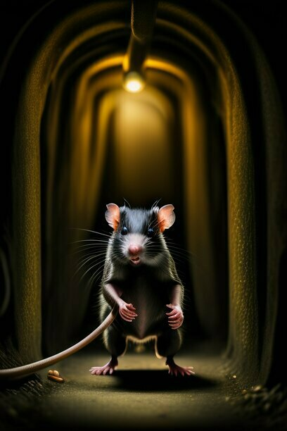
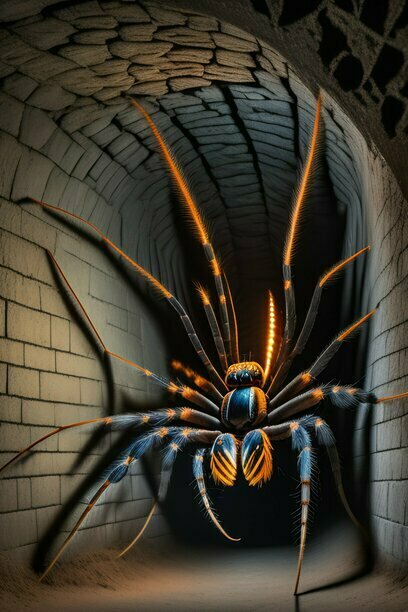

# Бестиарий

## Вортор

*"Кажется, я где-то это уже видел..."*

Вортор - одно из самых ужасных порождений тьмы. Он не отнимает у тебя жизнь, но, блуждая снова и снова по одним и тем же закоулкам подземелья, ты постепенно утратишь разум и потеряешь надежду выбраться. Лучше вообще не встречаться с этой светящейся воронкой, если ты не хочешь потратить время на прохождение одних участков подземелья несколько раз.

## Крыса

*"О нет, они везде!"*

На объедках, сбрасываемых в канализацию, подпитываясь зловредной энергией Сердца Тьмы эти чудовища выросли до невообразимых размеров и жаждут свежей пищи. Они обязательно нападут на тебя, чтобы откусить кусочек или, если повезет, сожрать целиком. Советую, избегать их, если можешь.

## Паук

*"Тут должен быть каламбур про паучьи сети и Сеть"*

Второе название этих пауков - гибель. Они отравят тебя ядом, разорвут жвалами, запутают в паутине. Еще ничего, если это один старый медлительный паук, но если их несколько рядом или они молодые и быстрые - будь особенно осторожен.

## Трава

*"Хуже, чем порез бумагой"*

Даже трава в подземелье может быть опасной. Если неловко встать на нее, почувствуешь, как крохотные острые ножи втыкаются твои ноги. Интересно, она красная сама по себе или кто-то уже проходил здесь до меня? Хорошо еще, что если быстро бежать по ней, то можно и не порезаться.

## Цветы

*"Хорошо еще, что они ничем не пахнут!"*

Что может вырасти в темном подземелье без солнечного света, среди чудовищ, в опасной близости от средоточия Тьмы? Уж точно не ромашки. Не стоит приближаться к этим растениям, которые скорее сами тебя "сорвут", чем позволят подойти к ним поближе. Всем же нужно чем-то питаться, постарайся не стать их обедом.

## Свинкс

*"Пора вспомнить все, чему вас учили в школе"*

Но это, скорее всего, не поможет. Язык Свинкса - язык Тьмы, его любимый урок - анатомия, его оценки: 5 по коварству, 5 по мрачности, 5 по человеколюбию (ммм, вкусненько!). Если вам придется рагадывать его загадки, помните об этом.

## Сердце тьмы

